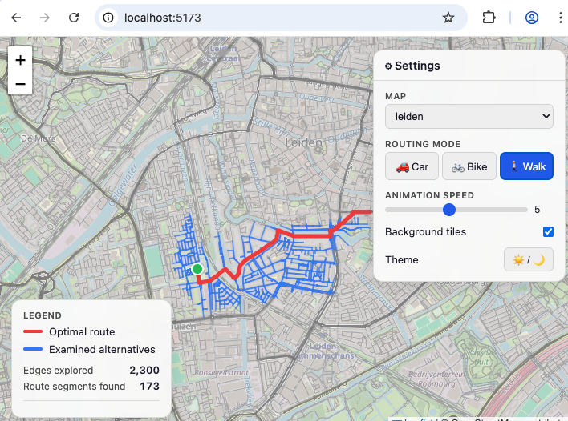

# AI Test for Greenfield Development

This directory contain directories with the results of executing standardized prompts, to see how well
different AI agents perform for software development.

Thge original input prompts are called `PROMPT.md` in the project directories. The source in the directories was generated by the tools specified in the `README.md` files.

The idea is to regenerate the same application or refactoring multiple
times using different AI tools, such as 
- Claude or Junie stand-alone
- or with the `superpowers` skill
- or using `ralph-tui` and `create-prd`
- or using a plain Ralph loop.

Some queries are for 'greenfield' software development, others are for
working on existing code bases.

## greenfield-routing-animation.md

An example of the UI can be found here:

Rijn Buve, 2026
